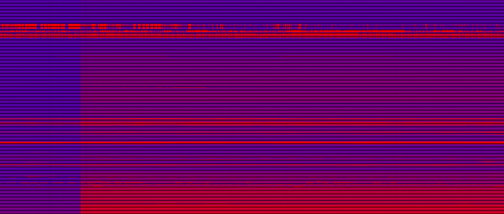

### DESCRIPTION

This is a minimal rf_pipelines run which incoherently dedisperses a few arbitrarily
chosen CHIME pathfinder data files.  It includes simple detrending, but no RFI removal, 
so the output is a mess!


### INSTRUCTIONS FOR RUNNING

The filenames in example3-chime.py assume you're running on chimer.physics.mcgill.ca.

First you'll need to generate the bonsai config hdf5 file from the bonsai text file.
(This is a temporary workaround for a currently-unimplemented feature in bonsai: on-the-fly
estimation of trigger variances.)
```
    bonsai-mkweight bonsai_config.txt bonsai_config.hdf5
```
Then run the example:
```
   ./example3-gbncc.py
```
This will generate a bunch of waterfall plots plus a file 'triggers.hdf5' containing
coarse-grained triggers.  The trigger file can be plotted with:
```
   bonsai-plot-triggers.py triggers.hdf5
```
After running the pipeline, you should see:
```
    raw_chime_*.png           waterfall plots of raw data
    detrended_chime_*.png     waterfall plots of detrended data
    triggers_tree*.png        output of the dedispersion transform
```
The waterfall plots have been split across 4 files as explained in the python script.
There are 3 dedispersion output files because the bonsai configuration file defines 
three trees to search different parts of parameter space.  

All the output files show a ton of RFI since there is no masking!  You will also
be able to see the noise source turn on/off every 21.47 seconds.
The github repo contains "reference" versions of some of these plots for comparison.




